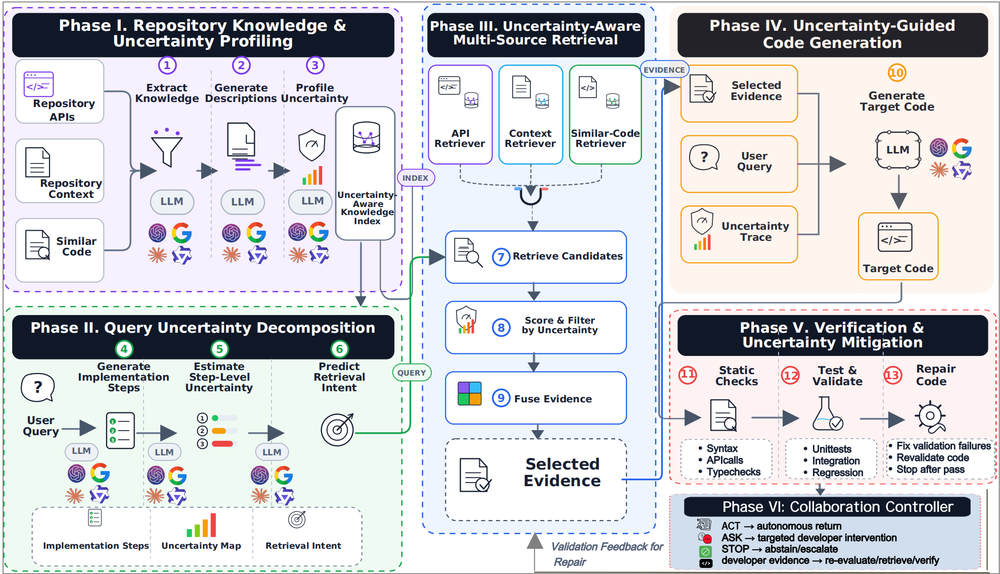
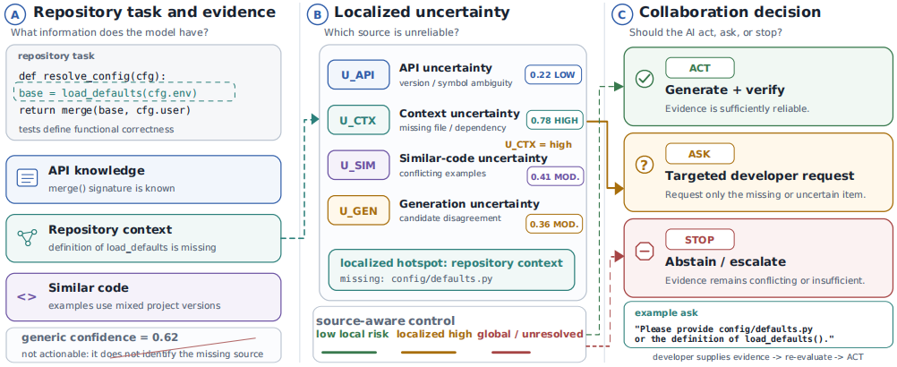

# OpenCoderX

**Uncertainty-aware retrieval, generation, verification, and collaboration for repository-level code generation.**

[](https://www.python.org/)
[](LICENSE)
[](results/tosem/final_integrity.json)

OpenCoderX treats repository-level code generation as reasoning under uncertainty over three evidence sources: project APIs, repository context, and similar code. It estimates source-specific uncertainty, filters and fuses evidence, verifies candidate implementations, and chooses whether to **ACT**, **ASK**, or **STOP**.

This repository is the public research artifact. It contains source code, frozen configurations, source-free task manifests, analysis-ready task records, evaluators, study protocols, prompts, tables, and figures. It intentionally does **not** contain the journal manuscript, credentials, participant records, private tests, or redistributed third-party repository source.

## Framework



OpenCoderX profiles repository knowledge, decomposes query uncertainty, retrieves and fuses heterogeneous evidence, generates target code, and closes the loop with executable validation and targeted repair.

## Motivation



A single confidence value cannot identify what is missing. OpenCoderX localizes risk to API knowledge, repository context, similar code, or generation, then converts that signal into an actionable collaboration decision.

## Artifact At A Glance

| Component | Released scope |
|---|---|
| Core framework | Five-phase OpenCoderX pipeline and ACT/ASK/STOP policy |
| Executable evaluation | ExecRepoBench-120, four LLM families, four methods, five candidates per task |
| Cross-language evaluation | CrossCodeEval-100 across Python, Java, TypeScript, and C# using native metrics |
| API grounding | RepoExec and CoderEval task-level API-set audit records |
| Automated reviewers | 12 gateway-mediated model configurations, 12 tasks each, 144 planned episodes |
| Human study | Protocol, instruments, schemas, and local collection UI; no participant-level data |
| Reproduction | Public task indexes, analysis records, integrity hashes, tables, figures, and audit scripts |

## 1. File Structure

```text
OCX_Uncertainty/
|-- assets/                     # README framework and motivation figures
|-- configs/                    # Frozen campaign/model configs and settings template
|-- data/manifests/             # Source-free task identities and provenance
|-- docs/                       # Architecture, data, experiments, studies, and provenance
|-- experiments/                # Generation and evaluation entry points
|-- human_study/                # Protocol, instruments, UI, schemas, and agent study
|-- opencoder/                  # Backward-compatible core Python package
|-- opencoderx/                 # Collaboration, provenance, leakage, and risk controls
|-- results/                    # Public task-level records, analyses, tables, and figures
|-- scripts/                    # Preparation, analysis, plotting, and integrity tools
|-- tests/                      # Unit and protocol tests
`-- tools/                      # Public-release construction utilities
```

The internal `opencoder` namespace is retained so the frozen experiment runners remain executable. New collaboration and artifact modules live under `opencoderx`; all public research terminology uses **OpenCoderX**.

## 2. Installation

```bash
git clone https://github.com/Rocky5502/OCX_Uncertainty.git
cd OCX_Uncertainty
python3 -m venv .venv
source .venv/bin/activate
python -m pip install --upgrade pip
python -m pip install -e ".[dev,analysis]"
```

Run the provider-free checks before configuring an API:

```bash
make doctor
make test
make verify-public
```

Live experiments are never started during installation or testing.

## 3. Configure `settings.json`

Copy the human-readable template and edit only local, non-secret options:

```bash
cp configs/settings.example.json configs/settings.json
```

The frozen experiment parameters remain in `configs/tosem/`. `settings.json` records local paths and selects environment-variable names; it must not contain a credential.

For an OpenAI-compatible gateway:

```bash
cp .env.example .env
```

Then set the values locally:

```dotenv
OPENCODER_LLM_BASE_URL=https://your-compatible-endpoint.example/v1
OPENCODER_LLM_API_KEY=replace_locally
```

The client also recognizes `ZHIZENGZENG_API_KEY` for compatibility with the frozen campaign. `.env` is ignored by Git. See [Configuration](docs/CONFIGURATION.md) for official-provider and gateway examples.

## 4. Example Dataset

The public task catalog is [`data/manifests/task_catalog.csv`](data/manifests/task_catalog.csv). The JSONL manifests retain task identities, upstream row indexes, repository names, selection metadata, and artifact hashes while excluding repository source and reference implementations.

```json
{
  "task_id": "execrepobench-0010-002176391c",
  "source_dataset": "CSJianYang/ExecRepoBench",
  "upstream_row_index": 10,
  "repo_name": "Chronyk",
  "language": "python",
  "dependency_complete": true,
  "reference_tests_pass": true,
  "artifact_hash": "..."
}
```

## 5. Data Fields

Core public fields are:

| Field | Meaning |
|---|---|
| `task_id` | Stable task identity fixed before model outputs were inspected |
| `artifact_hash` | SHA-256-derived identity for the selected upstream task |
| `repository` / `repo_name` | Upstream repository identifier |
| `upstream_row_index` | Row in the official benchmark source |
| `dependency_complete` | Required local repository dependencies passed the audit |
| `reference_tests_pass` | Reference implementation passed the reconstructed tests |
| `candidate_correct_count` | Correct candidates among the frozen five samples |
| `selected_output_correct` | Correctness after the method's declared selection/repair policy |
| `uncertainty` | Aggregate pre-decision risk score |
| `evidence_ids` | Stable identifiers of retrieved evidence, without source payloads |
| `usage` / token columns | Provider-reported request and token accounting |

The complete schemas and benchmark-specific fields are documented in [Datasets](docs/DATASETS.md) and [Results](results/README.md).

## 6. Preprocessing The Data

OpenCoderX does not mirror third-party repository code. Obtain each benchmark from its official source, then reconstruct the frozen inputs:

```bash
# ExecRepoBench: adapt upstream blocks, validate repositories/tests, and freeze 120 tasks
python scripts/prepare_execrepobench_120.py --help
python scripts/validate_execrepobench_120.py --help
python scripts/freeze_execrepobench_120.py --help

# CrossCodeEval: select 25 tasks per language under the frozen repository cap
python scripts/prepare_crosscodeeval_subset.py --help
```

The expected source hashes and selection rules are embedded in the scripts and protocol records. See [Dataset Reconstruction](docs/DATASETS.md) before downloading data.

## 7. Web Interface For Human Review

The local interface supports tutorial, consent, demographics, counterbalanced review tasks, confidence judgments, and append-only JSONL collection.
Because source-bearing study stimuli are not redistributed, first reconstruct the benchmark inputs described in Section 6 and generate a fresh local study package:

```bash
python human_study/prepare_study.py
python human_study/validate_study.py
python human_study/serve_study.py --port 8765
```

Open `http://127.0.0.1:8765/start`. Empirical mode requires a completed ethics-determination file and newly generated invitation codes. The public artifact contains no participant responses, invitation codes, or private stimuli. The documented cohort comprised 24 uncompensated technical volunteers and a 12-task protocol (288 task episodes); because response-level records and an institutional ethics determination are not part of the release, no human-condition effect is estimated here.

See [Human Study](docs/HUMAN_STUDY.md) before recruitment.

## 8. Running The Experiments

### ExecRepoBench-120

The frozen campaign compares Direct Generation, Standard RAG, RAG + Verify/Repair, and OpenCoderX with five candidates, temperature 0.7 (provider default for Claude), and at most two repair rounds.

```bash
# Cost and endpoint checks should precede any paid run.
python scripts/doctor.py
python scripts/estimate_experiment_cost.py --help

# Explicitly launch only after reviewing the frozen protocol and cost guard.
python scripts/run_tosem_confirmatory.py --workers 2
python scripts/analyze_tosem_confirmatory.py
```

### CrossCodeEval-100

```bash
python scripts/run_crosscodeeval_confirmatory.py --help
python scripts/analyze_crosscodeeval_confirmatory.py
```

CrossCodeEval is evaluated with native exact match, edit similarity, and identifier F1. It is not reported as an executable benchmark.

### Automated Reviewer Study

The public records reproduce the 144-episode gateway-mediated robustness analysis without making API calls:

```bash
make agent-analysis
```

The campaign used GPT, Claude, Gemini, DeepSeek, Qwen, Kimi, Grok, Llama, GLM, MiniMax, Doubao, and ERNIE model families. These are gateway-hosted model configurations, not human participants or consumer-product evaluations.

## Results Snapshot

Selected-output executable correctness on ExecRepoBench-120 was:

| Model | Direct | Standard RAG | RAG + Verify/Repair | OpenCoderX |
|---|---:|---:|---:|---:|
| GPT-4o-mini | 16.7 | 25.8 | 32.5 | 30.8 |
| Gemini 2.5 Flash | 22.5 | 25.8 | 35.0 | 36.7 |
| Claude Sonnet 5 | 51.7 | 58.3 | 73.3 | 74.2 |
| Qwen3-Coder-Plus | 48.3 | 53.3 | 60.8 | 60.0 |

OpenCoderX is not universally superior to the matched verification-and-repair control. Its value is model- and evidence-dependent. Aggregate uncertainty AUROC for executable failure detection was 0.632, 0.602, 0.692, and 0.596 for GPT, Gemini, Claude, and Qwen, respectively.

In the automated-reviewer study, 134 of 144 planned outputs were executable, 10 were missing, and there were zero evaluator errors and zero served-model mismatches. Aggregate uncertainty display improved planned-denominator end-to-end success by 8.3 percentage points over generic review, but the model-clustered 95% interval `[-2.1, 18.8]` included zero. Targeted guidance changed success by -2.1 points, interval `[-12.5, 8.3]`; superiority is not claimed.

See [`results/tosem/results_memo.md`](results/tosem/results_memo.md) and [Results](results/README.md) for full tables, intervals, resources, and caveats.

## Reproduce Tables And Figures

```bash
make tables
make figures
make agent-analysis
make verify-public
```

Generated LaTeX tables are under `results/tosem/publication_tables/latex/`; vector and raster figures are under `results/tosem/publication_figures/`. The manuscript is deliberately excluded.

## Integrity And Evidence Boundaries

- The public technical records contain 1,920 ExecRepoBench task-method-model cells and 800 CrossCodeEval task-method-model cells.
- Public automated-reviewer records contain 144 unique episodes: 134 executable and 10 missing.
- Missing provider outputs are never silently counted as correct or incorrect; planned-denominator sensitivity is reported separately.
- Multi-SWE-bench is not included because the official Docker evaluator was unavailable and no quantitative claim was made.
- Provider updates may change future reruns; model IDs, hashes, prompts, seeds, and protocol amendments are frozen in the artifact.
- Generated code can be incorrect or insecure. Run tests, static analysis, licensing review, and human review before deployment.

## Citation

Citation metadata is provided in [`CITATION.cff`](CITATION.cff). Please cite the archival paper associated with the artifact when its final bibliographic record is available. The repository contains no manuscript PDF.

## License And Third-Party Material

OpenCoderX source code is released under the [MIT License](LICENSE). Benchmark data and source repositories remain governed by their original licenses. The public manifests are derived metadata and hashes; users must obtain source-bearing data from official benchmark distributions. See [Third-Party Notices](THIRD_PARTY.md).

## Contact

For artifact questions, open a GitHub issue. Security-sensitive reports should follow [`SECURITY.md`](SECURITY.md).
